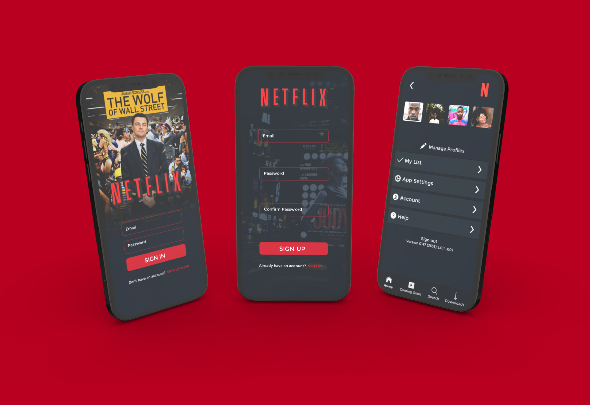

<h3 align = "center" fontSize="60px">
  Clone da plataforma de streaming <a href="https://www.netflix.com/">Netflix</a>
</h3>

    

<h2 align="left">🎨 Layout</h2>
   

      
      
      
   

   

      O Layout foi desenvolvido por contribuidores do projeto</a>, e você pode acessá-lo no Figma:
   
   - <a href="https://www.figma.com/file/PKmqN2I0YgcQglh4W9tKWV/netflix-redesign-(Community)?node-id=7%3A116">Template Figma</a> 📱
   

## 📋 Tópicos
- [Sobre 📖](#sobre-)
- [Layout 🎨](#layout-)
- [Como Usar 🤔](#como-usar-)

## :rocket: Tecnologias
-  Flutter
-  API Rest
-  Font Awesome
-  Flutter_Video_Player
 
<h2 align="left">📖 Sobre</h2>

O projeto Netflix foi desenvolvido para buscar e inspirar mais o conhecimento, buscando atender melhorias e antingir o maximo de expectativas para novas tecnologias.
A NetFlix se trata de um app mobile feito em Flutter, para gerenciar uma locadora de filmes, serie e entre outros. Contendo varios recursos como o uso de de autenticação com Firebase Core e SignIn, Animações e Estilizações Personalizadas, entre vários outros pontos, como o uso do SharedPreferences.

Todos os dados dos catálogos como título, descrição, capa, foto de background e avaliação foram extraídos ao usar a [API TMDb](https://www.themoviedb.org/documentation/api).

### Funcionalidades

- [x] **Spinning Loading**: Efeito ao trazer os dados da API.

- [x] **Catálogo Destaque**: Selecionar um catálogo de forma aleatória e apresentá-lo na página inicial.

- [x] **Listagem Sessões**: Ao consumir a API separar os catálogos em sessões.

- [x] **Efeito Menu**: Criar um efeito no background do menu conforme o scroll da tela do usuário.

- [x] **Cartão Catálogo**: Apresentar um cartão com os detalhes do catálogo ao passar o mouse por cima da capa.

- [x] **Listagem Carrossel**: Apresentar botões de controle para manipular a visualização dos itens da sessão.

- [x] **Listagem Infinita**: Ao chegar no final da lista dos catálogos deve-se apresentar os mesmos itens do início.

- [x] **Video Player**: Reprodução de Filmes e Séries por meio de integração com API.

<h2 align="left">🤔 Como usar</h2>

## :alien: Autores
-  [Github](https://github.com/afonsoburginski/) -----  [Github](https://github.com/Kyuorhan/)
-  [Linkedin](https://www.linkedin.com/in/afonso-kevin-burginski-76aa05175/) ----- [Linkedin](https://www.linkedin.com/in/jhonny-kyuorhan/)

## 📝 Licença

Esse projeto está sob a licença MIT. Veja o arquivo [LICENSE](LICENSE.md) para mais detalhes.
